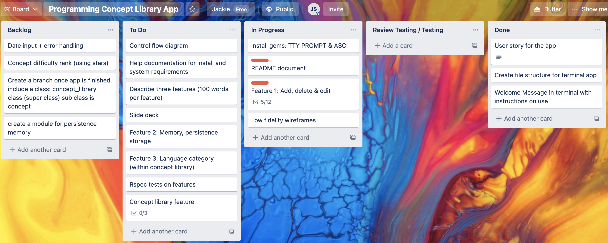
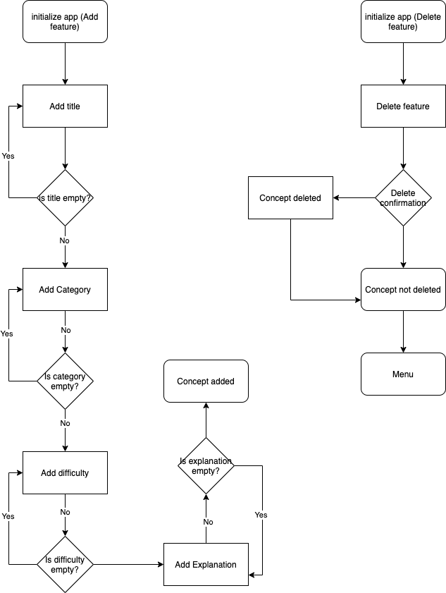

# Programming Concepts Application

## Statement of Purpose and Scope

The programming concepts applications aims to help users store programming concepts. The application allows users to enter the programming concept, state its difficulty, categorize it by it's programming language and store a brief description of the concept. Users can use the application to view programming concepts they may have learned in the past and forgotten or to simply check if their understanding of the concept is based on past entries. This application was designed for beginner developers to store programming concepts they have learned which they can access to revise and deepen their understanding and knowledge base with. As a beginner developer, there are many new programming concepts and terminologies which are quite foreign and difficult to grasp. By having a programming concept app, developers will have access to a whole library of concepts to fall back on. To use the app, beginner developers will store concepts they have learned throughout their journey to become a software developer.

## Features

### Create, Read, Update and Delete (CRUD)

The first feature the application will have is the ability to add, delete and edit programming concepts. When students learn a new programming concept, they will use the add feature to store a new concept. Once a concept is no longer required, to free up storage the concept can be deleted. If a concept is retaught and understood differently, the student has the ability to update that concept with a new explanation. The application will ensure that the correct inputs are used, as error handling will help identify if the incorrect input is used. The use of variables help store the information in a manner where it is easy to read for other developers that access the code base. The use of loops and control structures help keep the code DRY. Instructions on scenarios on how to use this feature is given in the testing section of this document.

### Persistence Storage

The second feature of the application is the use of persistence storage. This allows the application to store concepts that have been added, so that when the application is closed and reopened at a later date, the concept still remains in the application. This allows users to close the application when they are not using it, whilst still having the ability to access past concepts that have been stored. The error handling ensure that the relevant JSON files exist so that the information can be stored and read for a later date.

### Filtering

The last feature is the ability to filter through concepts in the concept library by stating the concept name, it's language category and its difficulty to understand. This filter feature gives users the flexibility and ease of accessing concepts with keywords rather than having to scroll through a list of concepts to find the one they are searching for. This will help simplify the steps it takes for a user to access the relevant information in a time efficient manner. The filter feature is made available by the ruby gem TTY-Prompt.

## Software Implementation Plan

The software implementation plan for the application was designed using Trello, as pictured below. You can find the link here: https://trello.com/b/Y7Ujg39p/programming-concept-library-app

## Control Flow Diagram

To structure the flow of the application, a control flow diagram was used. This is demonstrated below.

## Error Handling

The application utilizes error handling through control structures. The use of IF statements and case statements allows the application to test whether the correct input has been adopted by the user. This has been used through the CRUD features, which ensures that the user is not inputting blank text and incorrect data types. If the input of the user is incorrect, a error message will prompt the user and relevant instructions will be given to help the user correct their input. Rescues have been adopted to ensure that the JSON file which the application uses to store its data exists. If the file does not exist, and error message will prompt the user.

## Testing

### Feature 1 CRUD:

##### Scenario 1: Add a new concept

1. Open the terminal and type in ruby app.rb (ensure you are in the correct directory).
2. Scroll down to add section and select Add.
3. Type in "Arrays" as the title.
4. Type in "Ruby" as the category.
5. Type in "5" for the difficulty level.
6. Type in "Test concept" for the explanation.
7. Now you will return back to the main menu. Select the programming concepts library.
8. You should expect to see the concept you typed as the last concept in the library.

##### Scenario 2: Edit a concept

1. Run ruby app.rb, as per scenario 1.
2. Scroll down to the edit section and select edit.
3. Type in the concept number you would like to edit, choose the last concept on the list.
4. Type in a letter to select the field you would like to edit. Type "n" to change the name and type enter.
5. Change the name to "test name" and type enter. You will automatically be returned to the main menu.
6. Select the programming concepts library on the menu.
7. Scroll down to the bottom and the concept you have edited will have "test name" as the concept name.

### Feature 2 Persistence Storage:

##### Scenario 1: Add a new concept, close application, reopen application and view saved concept

1. Open the terminal and type in ruby app.rb (ensure you are in the correct directory).
2. Scroll down to add section and select Add.
3. Type in "Arrays" as the title.
4. Type in "Ruby" as the category.
5. Type in "5" for the difficulty level.
6. Type in "Test concept" for the explanation.
7. Now you will return back to the main menu. Select exit.
8. Type in ruby app.rb again to run the program.
9. Select programming concept library.
10. Scroll down to the bottom and view the concept you just added.

##### Scenario 2: Delete new concept from storage

1. Run ruby app.rb, as per scenario 1.
2. Scroll down to the delete section and select delete.
3. Select the concept you would like to delete. Choose the last concept on the list.
4. Type in y or yes to confirm you want to delete the concept.
5. A prompt will confirm that the concept has now been deleted. Press enter to return to home menu.
6. Now you are back to the main menu. Select exit.
7. Type in ruby app.rb again to run the program.
8. Select the programming concepts library on the menu.
9. Scroll down to the bottom and the concept you have deleted will now be gone.

## Bash Script

To launch the application using the bash script, ensure you are in the correct directory and type "./run_app.sh".
